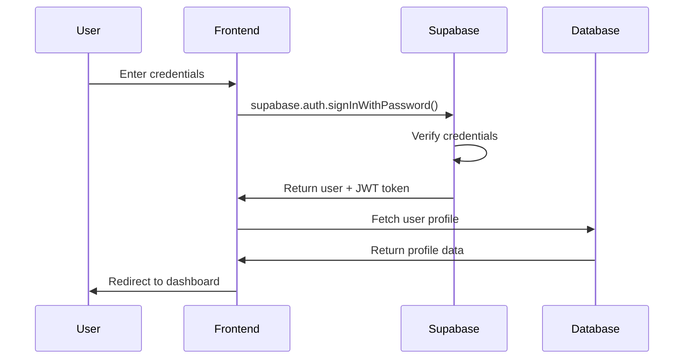

# 🔐 Authentication Update: Supabase Only

## ✅ **Demo Authentication Removed Successfully!**

All dummy/demo authentication has been removed from your SmartAgri application. The system now uses **only Supabase authentication**.

---

## 🚫 **What Was Removed**

### **1. Demo Login Credentials**
- ❌ Removed: `john@example.com / password123` demo credentials
- ❌ Removed: Demo credentials display box in login form
- ❌ Removed: `localStorage.setItem('authToken', 'dummy-jwt-token')`

### **2. Old Authentication Hook**
- ❌ Deleted: `hooks/useAuth.tsx` (old dummy auth system)
- ✅ Using: `contexts/AuthContext.tsx` (Supabase-based)

### **3. Dummy Authentication Logic**
- ❌ Removed: All hardcoded email/password checks
- ❌ Removed: Local storage token management for demo
- ❌ Removed: Fake JWT token generation

---

## ✅ **Current Authentication System**

### **Supabase Authentication Features**
- 🔐 **Real User Registration**: Create actual user accounts
- 🔑 **Secure Login**: JWT token-based authentication
- 📧 **Email Verification**: Optional email confirmation
- 🔄 **Password Reset**: Built-in password recovery
- 🛡️ **Security**: Row Level Security (RLS) policies
- 🔌 **Session Management**: Automatic token refresh

### **How It Works Now**
```typescript
// Login Process
const { login } = useAuth();
const success = await login(email, password);
if (success) {
  // Redirect to dashboard with real authentication
  router.push('/dashboard');
}
```

---

## 🧪 **Testing Real Authentication**

### **1. Create a Real Account**
1. Visit: `http://localhost:3000/signup`
2. Fill in your real information:
   - **Name**: Your actual name
   - **Email**: Your real email address
   - **Location**: Your actual location
   - **Password**: A secure password
3. Click "Create Account"
4. Account will be created in Supabase

### **2. Login with Real Credentials**
1. Visit: `http://localhost:3000/login`
2. Enter the email/password you just created
3. Click "Sign In"
4. You'll be redirected to the dashboard

### **3. Profile Management**
- Your profile data is stored in Supabase database
- All changes are saved to real database
- Data persists between sessions

---

## 🔄 **Authentication Flow**



---

## 🛡️ **Security Features**

### **Password Security**
- ✅ Minimum length requirements
- ✅ Encrypted storage in Supabase
- ✅ Secure password reset flow

### **Session Management**
- ✅ JWT tokens with expiration
- ✅ Automatic token refresh
- ✅ Secure logout (token invalidation)

### **Database Security**
- ✅ Row Level Security (RLS)
- ✅ Users can only access their own data
- ✅ API routes verify authentication

---

## 📋 **User Management**

### **Registration Flow**
```typescript
// Real user creation in Supabase
const { signup } = useAuth();
const success = await signup(name, email, password, location);
```

### **Login Flow**
```typescript
// Real authentication check
const { login } = useAuth();
const success = await login(email, password);
```

### **Profile Data**
```typescript
// Real profile stored in database
const profile = await db.getProfile(user.id);
```

---

## 🚨 **Important Notes**

### **No More Demo Credentials**
- ⚠️ You must create a real account to use the application
- ⚠️ No hardcoded usernames/passwords exist
- ⚠️ All authentication goes through Supabase

### **Database Integration**
- ✅ User profiles stored in `profiles` table
- ✅ All user data tied to Supabase user ID
- ✅ Real-time data synchronization

### **Environment Variables Required**
```bash
NEXT_PUBLIC_SUPABASE_URL=your_supabase_url
NEXT_PUBLIC_SUPABASE_ANON_KEY=your_supabase_anon_key
```

---

## 🔧 **Troubleshooting**

### **Login Issues**
1. **"Invalid credentials"** - Check email/password
2. **"User not found"** - Create account first at `/signup`
3. **Network errors** - Check Supabase configuration

### **Registration Issues**
1. **"Email already exists"** - Use different email or login
2. **"Weak password"** - Use stronger password
3. **"Database error"** - Check Supabase connection

### **Session Issues**
1. **Logged out unexpectedly** - Token expired, login again
2. **Can't access pages** - Authentication required
3. **Profile not loading** - Check database permissions

---

## 📊 **Authentication Status**

| Feature | Status | Details |
|---------|--------|---------|
| Demo Credentials | ❌ Removed | No more dummy logins |
| Supabase Auth | ✅ Active | Real user authentication |
| Registration | ✅ Working | Create real accounts |
| Login | ✅ Working | Secure authentication |
| Profile Management | ✅ Working | Real database storage |
| Session Management | ✅ Working | JWT tokens |
| Password Reset | ✅ Available | Supabase built-in |
| Email Verification | ✅ Available | Optional feature |

---

## 🎉 **Success!**

Your SmartAgri application now uses **100% real authentication** with Supabase! 

- ✅ No more demo credentials
- ✅ Real user accounts
- ✅ Secure authentication
- ✅ Database-backed profiles
- ✅ Production-ready security

**Next Steps:**
1. Create your real account at `/signup`
2. Login with your credentials at `/login`
3. Enjoy the fully authenticated experience!

🌱 **SmartAgri is now ready for real users!** 🚀
